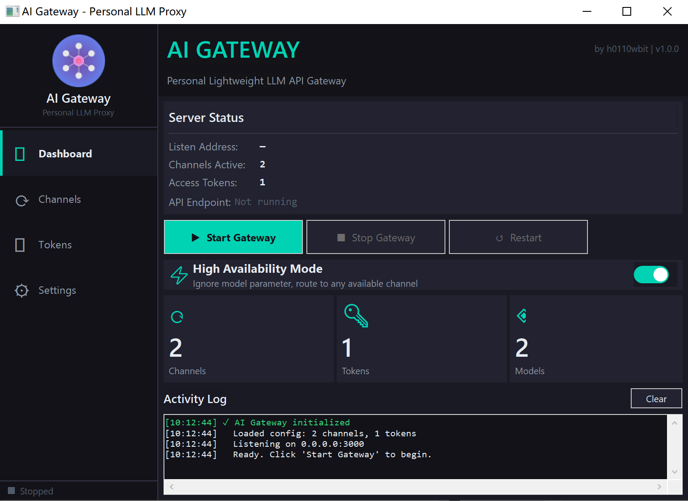
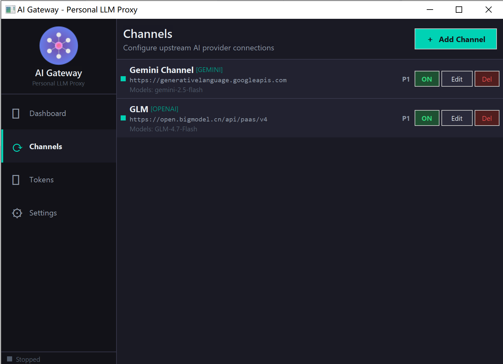
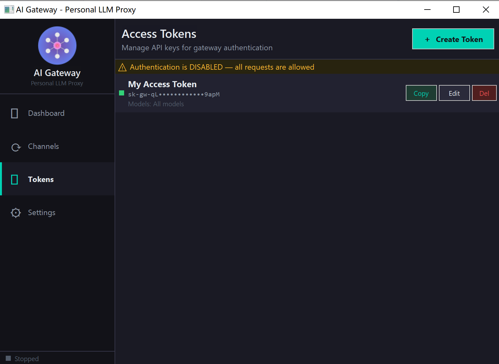
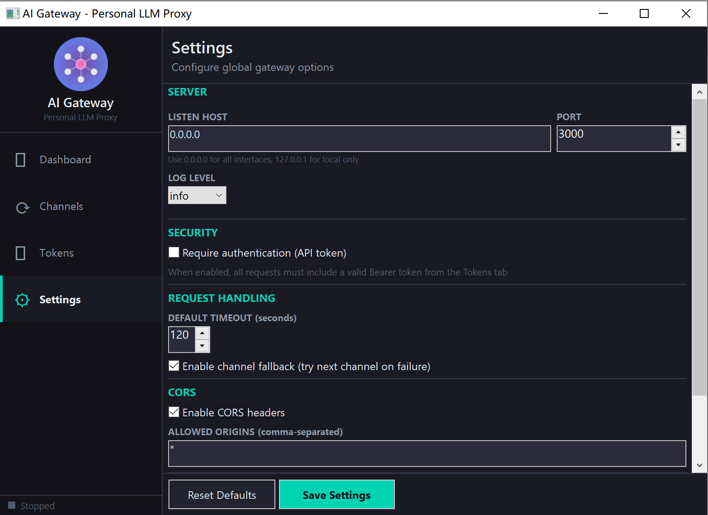

<div align="center">

# 🚀 AI Gateway

**A Personal, Lightweight LLM API Gateway with GUI**

[](https://www.python.org/)
[](https://www.microsoft.com/windows)
[](LICENSE)

[简体中文](README.md) · [English](README_EN.md)

</div>

---

## ✨ Why AI Gateway?

Managing multiple LLM providers can be frustrating:

- 🔴 Different API formats (OpenAI vs Anthropic vs Gemini)
- 🔴 Scattered API keys across projects
- 🔴 No fallback when a provider fails
- 🔴 Complex configuration files

**AI Gateway solves this with a simple GUI and unified API:**

- ✅ **One API endpoint** for all your LLM needs
- ✅ **Multi-format support** — OpenAI, Anthropic, and Gemini formats
- ✅ **Automatic conversion** between different provider formats
- ✅ **Channel fallback** when providers fail
- ✅ **Built-in clients** — Reverse-engineered Python clients for GLM, Kimi, DeepSeek, Qwen, MiniMax
- ✅ **Adaptive rate limiting** — Dynamic concurrency adjustment based on response time
- ✅ **Token management** with a visual interface
- ✅ **System tray** — Minimize to tray, run silently
- ✅ **No Docker, no database** — just run and go

---

## 📸 Screenshots

|                Dashboard                |               Channels                |
| :-------------------------------------: | :-----------------------------------: |
|  |  |

|              Tokens               |               Settings                |
| :-------------------------------: | :-----------------------------------: |
|  |  |

---

## 🎯 Features

### API & Protocol Support

- **Multi-Format API Support** — OpenAI, Anthropic, and Gemini API formats natively
- **Bidirectional Format Conversion** — Automatic conversion between all supported formats
- **Streaming Support** — Full SSE streaming with real-time format conversion

### Provider Support

- **HTTP Channels** — OpenAI, Anthropic, Gemini, Ollama, and builtin channels
- **Built-in Clients** — Reverse-engineered Python clients for Chinese LLM providers. For token acquisition, please refer to the original projects listed in the Acknowledgments:
  - 🟢 **GLM** (Zhipu AI)
  - 🔵 **Kimi** (Moonshot)
  - 🟣 **DeepSeek**
  - 🟠 **Qwen** (Alibaba)
  - 🟡 **MiniMax**

### Advanced Features

- **Channel Fallback** — Automatic failover to next available channel
- **High Availability Mode** — Route to any available channel regardless of model
- **Adaptive Rate Limiting** — Dynamic concurrency adjustment based on response time and error rate
- **Load Balancing** — Round-robin algorithm for distributing requests
- **Proxy Support** — Configure HTTP/SOCKS5 proxy per channel (not applicable to built-in channels)
- **Token Authentication** — Fine-grained access control with channel and model restrictions

### User Experience

- **GUI Interface** — No config file editing required
- **System Tray** — Minimize to system tray, support silent startup
- **Auto Start** — Configure Windows startup
- **Single Instance** — Prevent multiple instances from running
- **Lightweight** — Single EXE on Windows, no dependencies

---

## 🚀 Quick Start

### Run from Source

```bash
# Clone the repository
git clone https://github.com/h0110wbit/ai-gateway.git
cd ai-gateway

# Install dependencies
pip install -r requirements.txt

# Launch the GUI
python main.py
```

### Command Line Arguments

```bash
# Silent mode (minimize to system tray)
python main.py --silent

# Auto-start gateway on launch
python main.py --start

# Combined
python main.py --silent --start
```

### Build Windows EXE

```bash
build.bat
```

The executable will be at `dist/AIGateway.exe`.

---

## 📖 Usage

### 1. Add Channels

Navigate to **Channels** → **+ Add Channel**:

#### HTTP Channel Types

| Field    | Description                                   |
| -------- | --------------------------------------------- |
| Name     | Friendly name (e.g., "OpenAI GPT-4")          |
| Type     | openai / anthropic / gemini / ollama / custom |
| Base URL | Provider API endpoint                         |
| API Key  | Your provider API key                         |
| Models   | Comma-separated list (empty = all models)     |
| Priority | Lower number = higher priority                |
| Proxy    | Optional HTTP/SOCKS5 proxy configuration      |

**Default Base URLs:**

| Provider  | Base URL                                    |
| --------- | ------------------------------------------- |
| OpenAI    | `https://api.openai.com/v1`                 |
| Anthropic | `https://api.anthropic.com`                 |
| Gemini    | `https://generativelanguage.googleapis.com` |
| Ollama    | `http://localhost:11434`                    |

#### Built-in Client Types

| Field   | Description                               |
| ------- | ----------------------------------------- |
| Name    | Friendly name (e.g., "Zhipu GLM-4")       |
| Type    | builtin:glm / builtin:kimi, etc.          |
| API Key | Refresh token or API key for the platform |
| Models  | Auto-populated, no manual configuration   |

### 2. Create Access Tokens

Navigate to **Tokens** → **+ Create Token**

- Set token name and key
- Optional: Restrict accessible channels
- Optional: Restrict accessible models

Use this token in your client's `Authorization: Bearer <token>` header.

### 3. Start the Gateway

Navigate to **Dashboard** → Click **▶ Start Gateway**

Default endpoint: `http://localhost:3000`

**Dashboard Features:**

- View gateway status
- Real-time request statistics
- Enable/Disable high availability mode
- Quick start/stop service

### 4. Connect Your Client

```python
from openai import OpenAI

client = OpenAI(
    base_url="http://localhost:3000/v1",
    api_key="your-gateway-token",
)

response = client.chat.completions.create(
    model="gpt-4o",
    messages=[{"role": "user", "content": "Hello!"}]
)
```

---

## 🔌 API Endpoints

### OpenAI-Compatible Endpoints

| Method | Path                   | Description                            |
| ------ | ---------------------- | -------------------------------------- |
| GET    | `/health`              | Health check                           |
| GET    | `/v1/models`           | List available models                  |
| POST   | `/v1/chat/completions` | Chat completions (streaming supported) |

### Anthropic-Compatible Endpoints

| Method | Path           | Description                                  |
| ------ | -------------- | -------------------------------------------- |
| POST   | `/v1/messages` | Anthropic Messages API (streaming supported) |

### Gemini-Compatible Endpoints

| Method | Path                                     | Description                                  |
| ------ | ---------------------------------------- | -------------------------------------------- |
| POST   | `/v1beta/models/{model}:generateContent` | Gemini generateContent (streaming supported) |

---

## 🔄 Format Conversion

AI Gateway supports bidirectional conversion between **OpenAI**, **Anthropic**, and **Gemini** formats:

| Client Format | Channel Type | Conversion                 |
| ------------- | ------------ | -------------------------- |
| OpenAI        | Anthropic    | Request/Response converted |
| OpenAI        | Gemini       | Request/Response converted |
| Anthropic     | OpenAI       | Request/Response converted |
| Anthropic     | Gemini       | Request/Response converted |
| Gemini        | OpenAI       | Request/Response converted |
| Gemini        | Anthropic    | Request/Response converted |

Streaming responses are converted in real-time via SSE.

---

## 🛠️ Integration Examples

### OpenAI SDK

```python
from openai import OpenAI

client = OpenAI(
    base_url="http://localhost:3000/v1",
    api_key="your-gateway-token",
)

response = client.chat.completions.create(
    model="gpt-4o",
    messages=[{"role": "user", "content": "Hello!"}],
    stream=True
)

for chunk in response:
    print(chunk.choices[0].delta.content, end="")
```

### Anthropic SDK

```python
from anthropic import Anthropic

client = Anthropic(
    base_url="http://localhost:3000",
    api_key="your-gateway-token",
)

response = client.messages.create(
    model="claude-sonnet-4-20250514",
    max_tokens=1024,
    messages=[{"role": "user", "content": "Hello!"}]
)
```

### Google Gemini SDK

```python
import httpx

response = httpx.post(
    "http://localhost:3000/v1beta/models/gemini-pro:generateContent",
    headers={"x-goog-api-key": "your-gateway-token"},
    json={
        "contents": [{"parts": [{"text": "Hello!"}]}]
    }
)
print(response.json())
```

### Claude Code CLI

```bash
export ANTHROPIC_BASE_URL=http://localhost:3000
export ANTHROPIC_API_KEY=your-gateway-token

claude
```

### cURL (OpenAI Format)

```bash
curl http://localhost:3000/v1/chat/completions \
  -H "Authorization: Bearer your-token" \
  -H "Content-Type: application/json" \
  -d '{
    "model": "gpt-4o",
    "messages": [{"role": "user", "content": "Hello!"}],
    "stream": true
  }'
```

### cURL (Anthropic Format)

```bash
curl http://localhost:3000/v1/messages \
  -H "x-api-key: your-token" \
  -H "anthropic-version: 2023-06-01" \
  -H "Content-Type: application/json" \
  -d '{
    "model": "claude-sonnet-4-20250514",
    "max_tokens": 1024,
    "messages": [{"role": "user", "content": "Hello!"}],
    "stream": true
  }'
```

### cURL (Gemini Format)

```bash
curl "http://localhost:3000/v1beta/models/gemini-pro:generateContent" \
  -H "x-goog-api-key: your-token" \
  -H "Content-Type: application/json" \
  -d '{
    "contents": [{"parts": [{"text": "Hello!"}]}]
  }'
```

---

## ⚡ High Availability Mode

Enable **High Availability Mode** from the Dashboard to route requests to any available channel, ignoring the model parameter. This is useful when you want maximum availability and don't care which specific model responds.

When enabled:

- The gateway ignores the `model` parameter in requests
- Routes to the first available channel based on priority
- Uses the first model configured in that channel

---

## 🎛️ Adaptive Rate Limiting

Each channel supports adaptive rate limiting, dynamically adjusting concurrency based on real-time performance:

### Rate Limit Modes

- **Fixed Mode** — Set a static maximum concurrency limit
- **Adaptive Mode** — Automatically adjust based on response time and error rate

### Adaptive Algorithm

- Low response time and low error rate → Increase concurrency
- High response time → Gradually decrease concurrency
- High error rate → Rapidly decrease concurrency

### Configuration Parameters

| Parameter                | Description                                  | Default  |
| ------------------------ | -------------------------------------------- | -------- |
| Max Concurrency          | Fixed mode limit / Disable for adaptive mode | Adaptive |
| Min Concurrency          | Starting value for adaptive mode             | 1        |
| Max Adaptive Concurrency | Upper limit for adaptive mode                | 10       |
| Response Time Thresholds | Thresholds for good/poor performance         | 1s/5s    |
| Error Rate Threshold     | Error rate to trigger slowdown               | 10%      |

---

## ⚙️ Configuration

Configuration is stored in `config.json`:

```json
{
  "settings": {
    "host": "0.0.0.0",
    "port": 3000,
    "require_auth": true,
    "enable_fallback": true,
    "enable_cors": true,
    "high_availability_mode": false,
    "auto_start": false
  },
  "channels": [
    {
      "id": 1,
      "name": "OpenAI",
      "type": "openai",
      "base_url": "https://api.openai.com/v1",
      "api_key": "sk-...",
      "models": ["gpt-4o", "gpt-4o-mini"],
      "enabled": true,
      "priority": 1,
      "timeout": 60,
      "max_retries": 3,
      "proxy_enabled": false,
      "proxy_url": "",
      "max_concurrency": null,
      "min_concurrency": 1,
      "max_adaptive_concurrency": 100,
      "response_time_low": 1.0,
      "response_time_high": 5.0,
      "error_rate_threshold": 0.1,
      "increase_step": 2,
      "decrease_factor": 0.8,
      "stats_window_size": 100,
      "cooldown_seconds": 5.0
    }
  ],
  "tokens": [
    {
      "id": 1,
      "name": "My Token",
      "key": "sk-gw-...",
      "enabled": true,
      "allowed_channels": [],
      "allowed_models": []
    }
  ]
}
```

---

## 📄 License

This project is licensed under the MIT License - see the [LICENSE](LICENSE) file for details.

---

## 🙏 Acknowledgments

The reverse-engineered Python clients in this project are based on the following projects by [xiaoY233](https://github.com/xiaoY233):

- [GLM-Free-API](https://github.com/xiaoY233/GLM-Free-API.git) - Zhipu GLM reverse-engineered Python client
- [DeepSeek-Free-API](https://github.com/xiaoY233/DeepSeek-Free-API.git) - DeepSeek reverse-engineered Python client
- [MiniMax-Free-API](https://github.com/xiaoY233/MiniMax-Free-API.git) - MiniMax reverse-engineered Python client
- [Qwen-Free-API](https://github.com/xiaoY233/Qwen-Free-API.git) - Qwen reverse-engineered Python client
- [Kimi-Free-API](https://github.com/xiaoY233/Kimi-Free-API.git) - Kimi reverse-engineered Python client

---

<div align="center">

**Built with ❤️ and Python**

</div>
